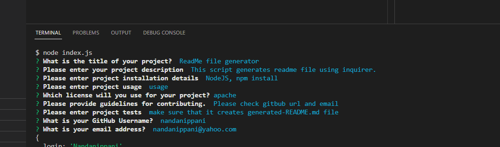
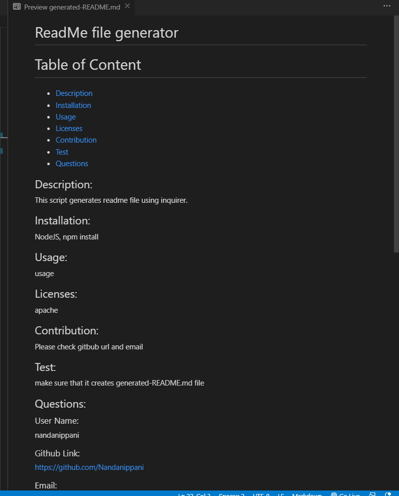

# ReadmeGenerator
## Description
This script generates redme file using inquirer.
## Main Page
Main page looks like this

Generated readme file looks like this

### Generated readme file

generated-README.md file generated from this application

### URL of the Github repository
https://github.com/Nandanippani/ReadmeGenerator

## Installation

N/A

## Usage 

node index.js, npm install

## Credits
N/A

## License
Please refer to the license in the repo.
